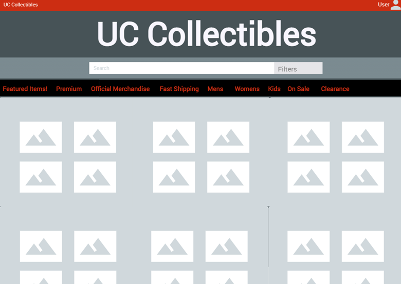
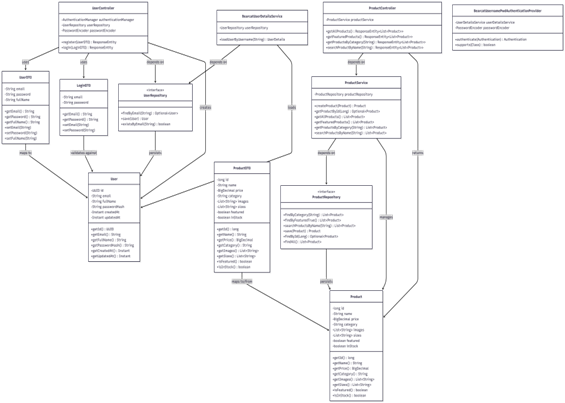
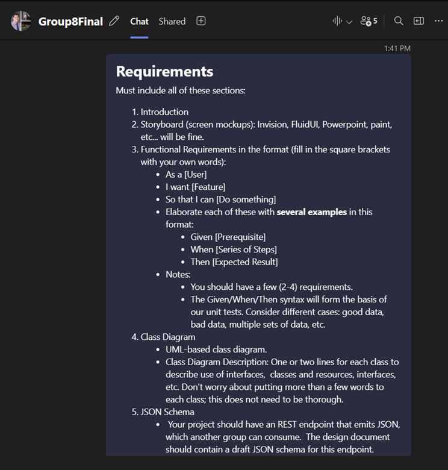

# FinalProject_Group8_EnterpriseAppDev
Group 8 Enterprise App Dev Final Project Spring 2026
1. Introduction: UC Collectibles is an online store for University of Cincinnati Bearcats merchandise. Customers can browse and shop for official UC apparel, activewear, and accessories. The site requires an account to view products. New customers create an account with their email, full name, and password. Existing customers log in to access the catalog. Once logged in, customers see a homepage with featured products, a hero section, and key features (premium quality, official merchandise, fast shipping). The Products page shows all available items in a grid with images, names, prices, and categories. Customers can filter by category (Apparel, Activewear, Accessories) and sort by featured, price (low to high or high to low), or name. They can also search for products by name. Featured items are highlighted with a badge. Each product card shows the image, name, price, category, and stock status. The site is responsive and works on mobile, tablet, and desktop. Currently, customers can browse and search products, but cannot add items to a cart, view product details, or complete purchases. Future features will include shopping cart, checkout, and order management. The platform focuses on showcasing UC Bearcats merchandise and providing a smooth browsing experience for fans and supporters.

 2. (Storyboard):

   

   

  3.
Functional Requirement #1
As a new customer
I want to create an account
So that I can access and browse UC Collectibles products
Scenario 1: Successful account creation (valid data)
Given the user is not logged in and is on the registration page
When the user enters a valid email, full name, and password and submits the form
Then the account is created successfully, and the user is redirected to the 		homepage
Scenario 2: Registration fails with missing required fields
Given the user is on the registration page
When the user submits the form with one or more required fields empty
Then the system displays validation errors and prevents account creation
Functional Requirement #2
As a logged-in customer
I want to search, filter, and sort products
So that I can quickly find items I am interested in
Scenarios
Scenario 1: Filter products by category
Given the Products page displays multiple categories
When the user selects a category filter (Apparel, Activewear, or Accessories)
Then only products from the selected category are displayed
Scenario 2: Sort products by price
Given multiple products are displayed
When the user selects “Price: Low to High” or “Price: High to Low”
Then the products are reordered accordingly
Scenario 3: Search for a product by name
Given products exist in the catalog
When the user enters a product name in the search bar
Then only matching products are displayed


4.  UML – Class Diagrams
 



5.     JSON Schema.
```json
- {
  "$schema": "http://json-schema.org/draft-07/schema#",
  "$id": "https://api.uccollectibles.com/schemas/products-response.json",
  "title": "UC Collectibles Products API Response",
  "description": "List of University of Cincinnati Bearcats merchandise products",
  "type": "array",
  "items": {
    "$ref": "#/definitions/Product"
  },
  "definitions": {
    "Product": {
      "type": "object",
      "required": ["id", "name", "price", "category"],
      "properties": {
        "id": {
          "type": "integer",
          "description": "Unique product identifier",
          "example": 1
        },
        "name": {
          "type": "string",
          "description": "Product display name",
          "minLength": 1,
          "maxLength": 255,
          "example": "Bearcats Classic Logo T-Shirt"
        },
        "price": {
          "type": "number",
          "description": "Product price in USD",
          "minimum": 0,
          "multipleOf": 0.01,
          "example": 29.99
        },
        "category": {
          "type": "string",
          "description": "Product category",
          "enum": ["Apparel", "Activewear", "Accessories"],
          "example": "Apparel"
        },
        "images": {
          "type": "array",
          "description": "Array of product image URLs",
          "items": {
            "type": "string",
            "format": "uri"
          },
          "example": [
            "https://cdn.uccollectibles.com/products/tshirt-front.jpg",
            "https://cdn.uccollectibles.com/products/tshirt-back.jpg"
          ]
        },
        "sizes": {
          "type": "array",
          "description": "Available sizes for the product",
          "items": {
            "type": "string"
          },
          "example": ["S", "M", "L", "XL"]
        },
        "featured": {
          "type": "boolean",
          "description": "Whether the product is featured on homepage",
          "example": true
        },
        "inStock": {
          "type": "boolean",
          "description": "Current stock availability",
          "example": true
        }
      }
    }
  }
}
```


6.   Scrum Roles.
- Scrum Master – Rahim Zowange
- UI Specialist – Jaxon Coniglio, Blake Szalapski
- Business logic/ Persistence Specialist – Drew Spampinato, Drew Sellars

7. github.com project link
- https://github.com/Szalapbp/FinalProject_Group8_EnterpriseAppDev.git
8.  Github Repository Milestones 
9.

   

   This is the Teams chat we use to meet weekly.
